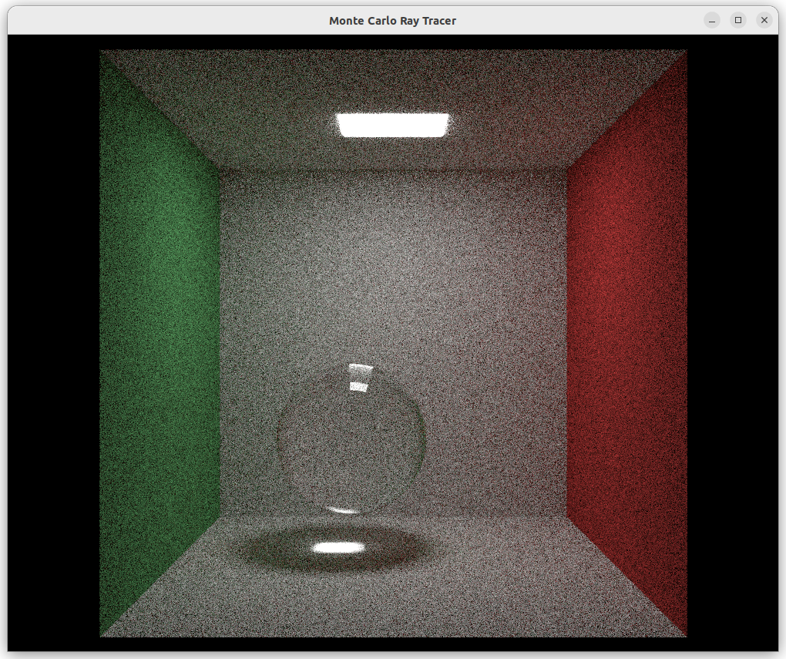
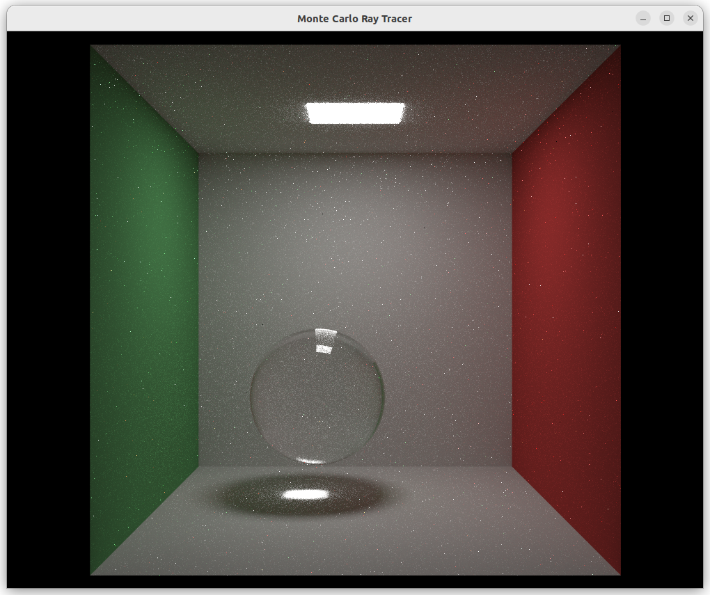

# Monte Carlo Ray Tracer

    
     
    Test scene with diffuse, metallic, and glass spheres, rendered with depth of field (100 samples per pixel, render time: ~7s).

## Quick Start
1. Download the latest GLFW source packages from [here](https://www.glfw.org/download.html) and copy them into `include/glfw/`.
2. Download the latest GLAD loaders from [here](https://glad.dav1d.de/) with the following settings:
    * Language: `C/C++`
    * Specification `OpenGL`
    * API gl: `Version 4.6`
    * Profile: `Core`
    * Options: Tick `Generate a loader`
3. Copy the `glad.h` file into `include/glad/`, the `khrplatform.h` file into `include/KHR/`, and the `glad.c` file into `src/`.
4. Clone the GLM repo from [here](https://github.com/g-truc/glm/tree/master) and copy the contents of the `glm` directory into `include/glm/`. 
5. Install dependencies: `sudo apt install cmake xorg-dev` (For non X11 on Unix users, check out [this guide](https://www.glfw.org/docs/latest/compile_guide.html) for more details).
6. Give permission to the build script: `chmod +x build.sh`
7. Build and run the program `./build.sh -r`.

## Features
This is a toy path tracer meant to explore concepts in computer graphics, parallel programming, as well as various statistical methods e.g. Monte Carlo estimation, multiple importance sampling, low-discrepancy samplers etc. Thus, some features present in production path tracers may not be implemented.

### Integrators
* `RandomWalkIntegrator`: For every ray intersection, uses importance sampling on the BRDFs of materials to choose the next ray direction, then recursively samples that direction.
* `SimplePathIntegrator`: Similar to the `RandomWalkIntegrator`, but changes the recursive function calls to an iterative one, and additionally carries out next event estimation by sampling the lights in the scene to further minimize error.

| `RandomWalkIntegrator` | `SimplePathIntegrator` |
|:----------------------:|:----------------------:|
|  |  |
| 200 samples per pixel, render time: ~34s. | 200 samples per pixel, render time: ~24s. |

As seen from these images, the noise present in the scene rendered by the `SimplePathIntegrator` is much smaller despite the shorter rendering time and equal number of samples per pixel.
However, new artefacts (the bright pixels) are introduced into the image. This could be solved in a later integrator incorporating multiple importance sampling.

### Samplers
* `IndependentSampler`: returns a uniform sample. 

### Materials
* `Lambertian`: perfectly diffuse material. Modifiable attributes:
    * Color
* `Metal`. Modifiable attributes:
    * Color
    * Fuzz
* `Dielectric`: glass-like material that both refracts and reflects light. Modifiable attributes:
    * Index of refraction

### Geometries
* Spheres
* Quadrilaterals

### Optimizations
* Parallelization using OpenMP (~7.4x speedup on 16 core machine).
* Bounding Volume Hierarchies (BVHs) to speed up ray intersection tests (~4.7x speedup).

## Acknowledgements
This project uses material from the following sources:
* [_Ray Tracing in One Weekend_](https://raytracing.github.io/books/RayTracingInOneWeekend.html).
* [_Ray Tracing: The Next Week_](https://raytracing.github.io/books/RayTracingTheNextWeek.html)
* [_Physically Based Rendering: From Theory To Implementation_](https://pbr-book.org/4ed/contents).