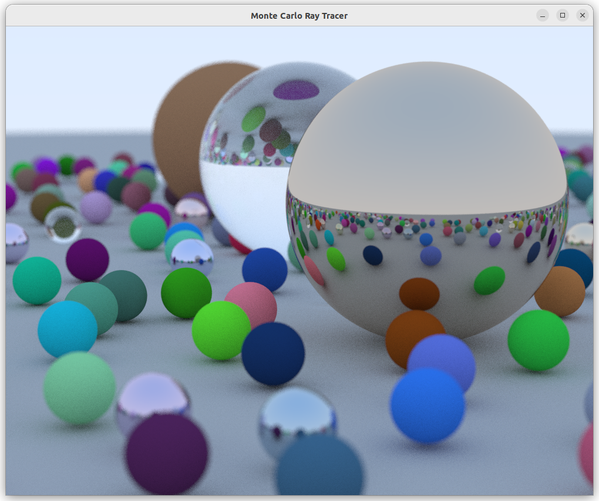

# Monte Carlo Ray Tracer

    
     
    Test scene with diffuse, metallic, and glass spheres, rendered with depth of field (100 samples per pixel, render time: 33.314s).

    
## Quick Start
1. Download the latest GLFW source packages from [here](https://www.glfw.org/download.html) and copy them into `include/glfw/`.
2. Download the latest GLAD loaders from [here](https://glad.dav1d.de/) with the following settings:
    * Language: `C/C++`
    * Specification `OpenGL`
    * API gl: `Version 4.6`
    * Profile: `Core`
    * Options: Tick `Generate a loader`
3. Copy the `glad.h` file into `include/glad/`, the `khrplatform.h` file into `include/KHR/`, and the `glad.c` file into `src/`.
4. Clone the GLM repo from [here](https://github.com/g-truc/glm/tree/master) and copy the contents of the `glm` directory into `include/glm/`. 
5. Install dependencies: `sudo apt install cmake xorg-dev` (For non X11 on Unix users, check out [this guide](https://www.glfw.org/docs/latest/compile_guide.html) for more details).
6. Give permission to the build script: `chmod +x build.sh`
7. Build and run the program `./build.sh -r`.

## Acknowledgements
This project uses material from the following sources:
* [_Ray Tracing in One Weekend_](https://raytracing.github.io/books/RayTracingInOneWeekend.html).
* [_Physically Based Rendering: From Theory To Implementation_](https://pbr-book.org/4ed/contents).